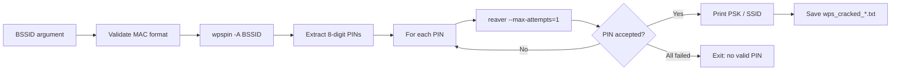

# WPS PIN Bruteforcer

Bash automation that combines **wpspin** (PIN generation from a target BSSID) with **reaver** (WPS PIN attempts) to recover the WPS PIN and WPA passphrase of a vulnerable access point.

Designed for authorized security assessments and lab environments (e.g. HTB CWPE coursework).

## How it works



1. **Input** — You pass the target access point BSSID (MAC address).
2. **PIN generation** — `wpspin -A <BSSID>` computes candidate WPS PINs (often based on known weak algorithms tied to the MAC).
3. **Bruteforce loop** — For each PIN, the script runs `reaver` once against interface `mon0` on the channel you pass with `-c`.
4. **Success** — When reaver reports `WPS PIN: '<pin>'`, the script prints the WPA PSK and SSID, writes a result file, and stops.
5. **Failure** — If every generated PIN fails, the script exits with a summary message.

## Prerequisites

| Requirement | Purpose |
|-------------|---------|
| Linux (or WSL with wireless passthrough) | `reaver` and monitor mode are Linux-oriented |
| **wpspin** | Generate PIN candidates from BSSID |
| **reaver** | WPS PIN attack against the AP |
| Wireless adapter supporting **monitor mode** and **packet injection** | Required for reaver |
| **root** / `sudo` | Reaver needs elevated privileges |

### Install tools (Debian / Kali example)

```bash
sudo apt update
sudo apt install reaver
# wpspin: install from your course/lab repo or build from source if not in apt
```

### Prepare the wireless interface

Put your adapter in monitor mode and name it `mon0` (or edit the script to match your interface name):

```bash
sudo airmon-ng check kill
sudo airmon-ng start wlan0
# Confirm monitor interface is mon0 (or change -i mon0 in the script)
```

Find the target AP channel first (e.g. `airodump-ng mon0` or `wash -i mon0`), then pass it with `-c`.

## Usage

```bash
chmod +x pinguess_upgraded.sh
sudo ./pinguess_upgraded.sh -c <channel> <BSSID>
```

**Example:**

```bash
sudo ./pinguess_upgraded.sh -c 6 60:38:E0:A2:3D:2A
```

### Arguments

| Argument / flag | Description |
|-----------------|-------------|
| `-c <channel>` | Target AP Wi-Fi channel (1–196). Required. |
| `BSSID` | Target AP MAC address in `XX:XX:XX:XX:XX:XX` format (case-insensitive hex) |
| `-h` | Show usage and exit |

### Output on success

- Console: correct PIN, WPA PSK, and SSID
- File: `wps_cracked_<BSSID_with_underscores>.txt` (e.g. `wps_cracked_60_38_E0_A2_3D_2A.txt`) containing BSSID, PIN, PSK, SSID, and timestamp

### Output on failure

After all generated PINs are tried without success:

```text
✗✗✗ Attack completed - No valid PIN found ✗✗✗
```

## Script configuration

These values are set inside `pinguess_upgraded.sh` and may need adjustment for your lab:

| Setting | Current value | Notes |
|---------|---------------|--------|
| Monitor interface | `mon0` | Change `-i` if your interface differs |
| Channel | `-c` flag | Must match the target AP channel (passed at runtime) |
| Reaver lock delay | `-l 100` | Seconds between attempts (only one attempt per PIN here) |
| Receive timeout | `-r 3:45` | Reaver receive timeout |
| Attempts per PIN | `--max-attempts=1` | One try per generated PIN |

## Legal and ethical use

**Only use this tool on networks you own or have explicit written permission to test.** Unauthorized access to computer networks and wireless systems is illegal in most jurisdictions. This repository is provided for education and authorized penetration testing.

## Troubleshooting

- **Missing or invalid channel** — Use `-c` with a number from 1 to 196 that matches the AP.
- **Invalid BSSID format** — Use six octets separated by colons: `AA:BB:CC:DD:EE:FF`.
- **No PINs generated** — Verify `wpspin` is installed and supports `-A` for your BSSID.
- **reaver fails immediately** — Check monitor mode, channel, signal strength, and that WPS is enabled on the target (and not locked).
- **Permission denied** — Run with `sudo`; reaver requires root.
- **Wrong interface** — Edit `-i mon0` to match `iw dev` / `airmon-ng` output.

## Repository contents

```
wpspin_bruteforcer/
├── pinguess_upgraded.sh   # Main automation script
└── README.md              # This file
```

## License

Add a license file if you plan to publish this repository (e.g. MIT, GPL, or “educational use only”). No license is included by default.
